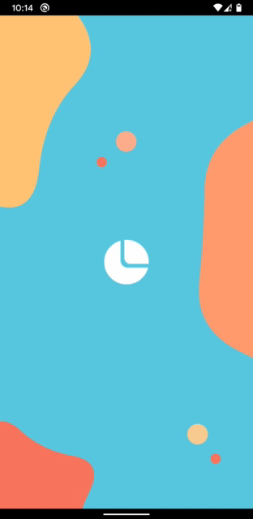

# Jelly

A widget to render moving blobby objects.

  
Implemented [this](https://dribbble.com/shots/7062770-Login-Flow) using Jelly

## Key Features

* Highly customizable Jelly rendering for Flutter.
* Multiple Jelly instances
* Overlap Jellys
* Tween shapes and change colors

## Getting Started

To use this package, add `jelly` as a [dependency in your pubspec.yaml file](https://flutter.io/platform-plugins/).

    dependencies:
      ...
      jelly: ^0.0.2

Now in your Dart code, you can use:

     import 'package:jelly_anim/jelly_anim.dart';

## Usage

     JellyAnim(jellyCount, size: Size(400, 400), duration: Duration(milliseconds: 200))

# LICENSE!

Jelly is [MIT-licensed](/LICENSE).

# Let us know!

We’d be really happy if you send us links to your projects where you use our component. Just send an email to sales@mindinventory.com And do let us know if you have any questions or suggestion regarding our work.